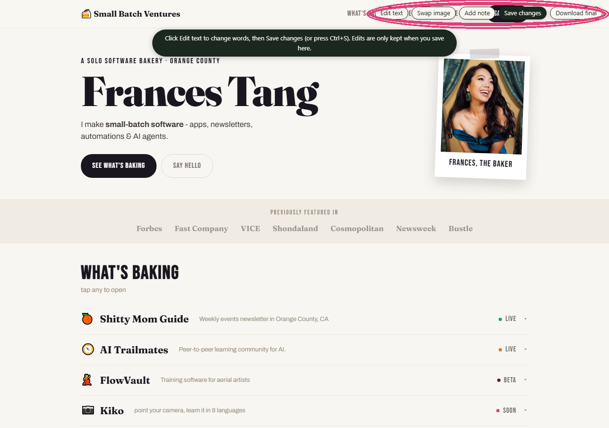

# html-live-edit

*Turn any static HTML page into something you can click and edit in your browser or send to someone to make edits and feedback on.*

Change the words, swap the images, stick a note on it, download the clean version. No VSCode, no accounts, no build step, no "wait what's a terminal."

*The toolbar (top-right) added straight onto a live page — nothing in the code was touched.*

## What you can do

A little toolbar shows up in the corner:

- **Edit text** — click any text and type. Like a doc. The design stays put.
- **Swap image** — click a placeholder, pick a photo (it gets baked into the file so it travels with it).
- **Add note** — drop a sticky note anywhere, for all the "can we make this pop??" feedback.
- **Save changes** — downloads your edited copy and keeps the editor on so you can keep going. Also works with **Ctrl/Cmd+S** (so the reflex "save" grabs your edits, not a blank page), and it warns you before you close with anything unsaved.
- **Download final** — spits out the real production file with all the editing bits stripped back out.

## Use it as a skill (Claude Code / Cursor / Codex)

Drop this folder into your skills folder — for Claude Code that's `~/.claude/skills/html-live-edit/` — then just say *"make this editable."* The agent grabs the toolkit, drops it into your page, and hands you back something you can edit. Done.

## No LLM? Do it by hand

1. Open your HTML file.
2. Copy everything in [`editor-kit.html`](editor-kit.html) and paste it right before `</body>`.
3. Open the page in a browser. Toolbar's in the corner. Go nuts.

That's the whole thing — it auto-tags the text and images when the page loads, so you don't have to mark anything up by hand.

## The fine print (a.k.a. what it won't do)

- **Text and images only.** It won't move sections around or restyle things — that's still a real-code job.
- **Swapped images get embedded as base64**, so the file travels anywhere but gets a little chunky with big images. Totally fine for mockups; optimize before it goes live.
- **"Download final" removes the editor, not your other work.**

## License

MIT. Use it, remix it, ship it. A credit is nice but I'm not going to come find you.

## Who made this

Made by **Frances Tang**, founder of [Small Batch Ventures](https://www.smallbatchventures.com) — where I build small, useful things and sometimes give them away. Come see what else I'm making. 🩷
